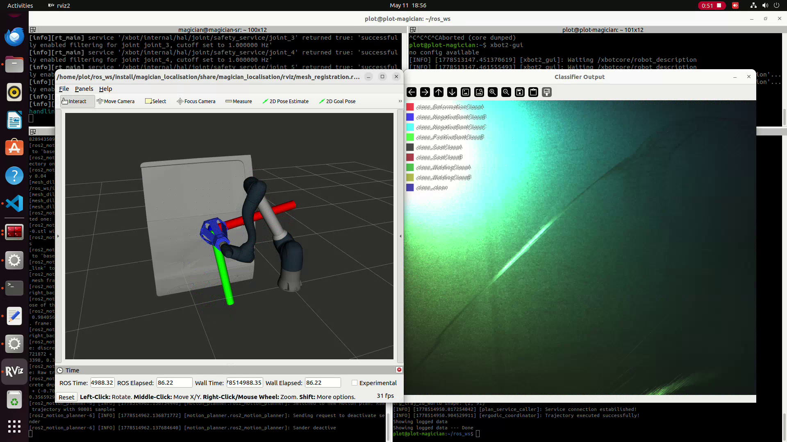
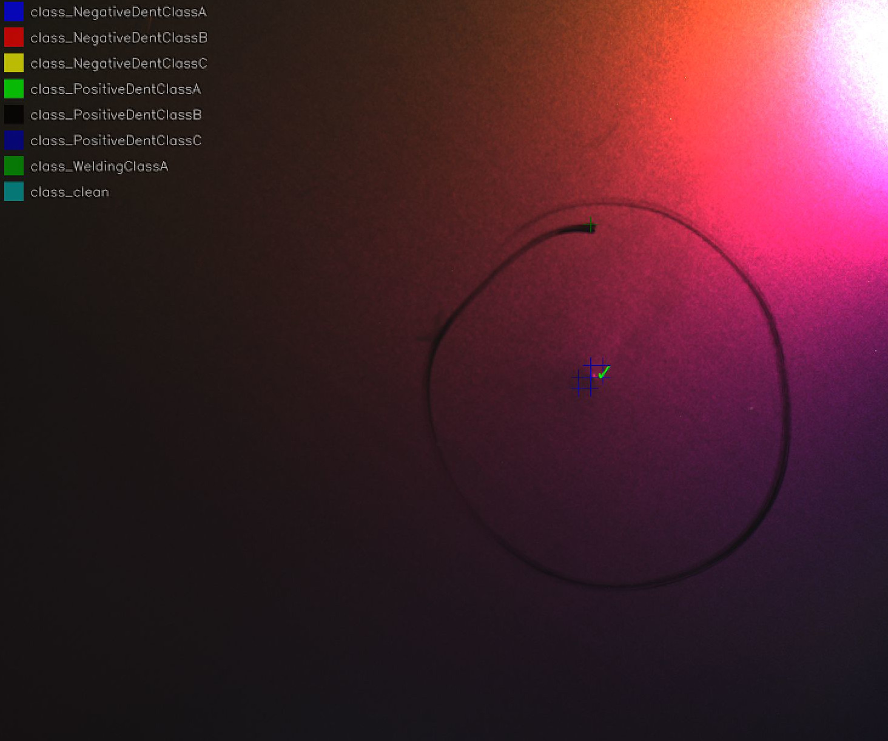
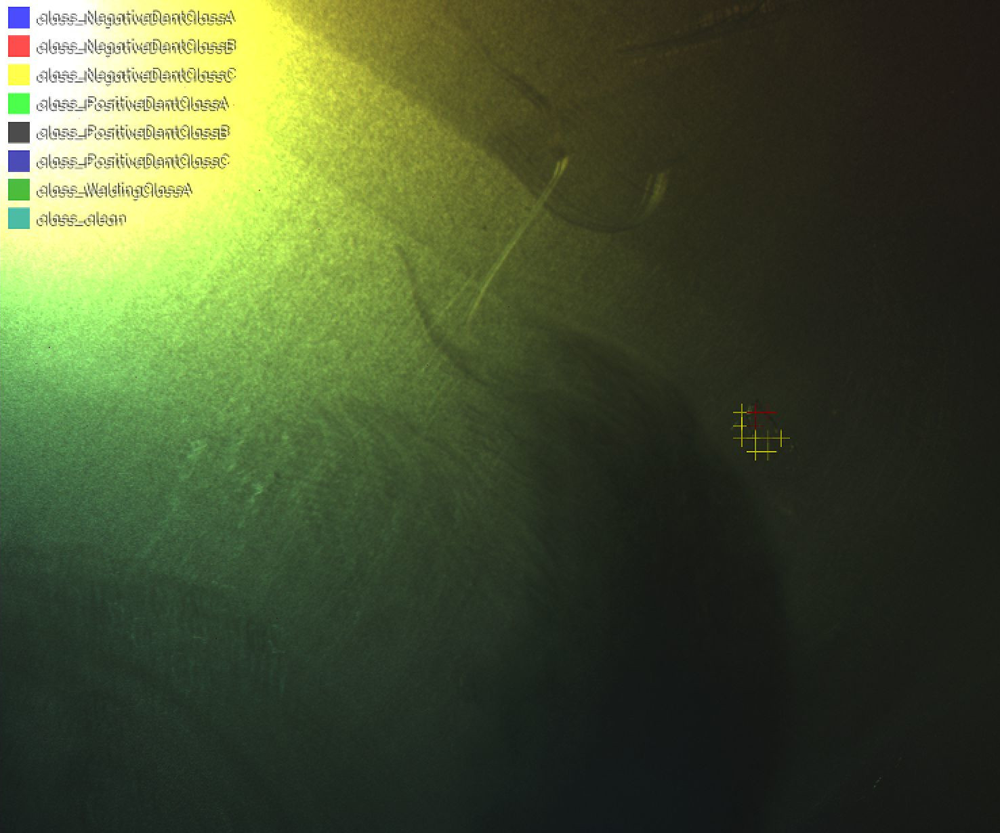

# Magician Vision Classifier

**Authors:** Ammar Qammaz, Nikos Vasilikopoulos  
**Institution:** Foundation for Research and Technology – Hellas (FORTH), Institute of Computer Science, Greece  
**Copyright:** © 2025 FORTH, Computer Science Department, Greece  
**License:** See `license.txt`

This work has been developed within the context of research funded by the European Union's Horizon 2020 research and innovation programme.

---

## Table of Contents

1. [Abstract](#abstract)
2. [Related Projects](#related-projects)
3. [System Architecture](#system-architecture)
4. [Installation](#installation)
5. [Dataset Preparation](#dataset-preparation)
6. [Training](#training)
7. [Inference](#inference)
8. [ROS2 Integration](#ros2-integration)
9. [Model Analysis and Evaluation](#model-analysis-and-evaluation)
10. [Shared Memory System](#shared-memory-system)
11. [Project Structure](#project-structure)
12. [References](#references)
13. [Contact](#contact)

---

## Abstract

The Magician Vision Classifier System provides a complete pipeline for training, evaluating, and deploying real-time, vision-based defect classifiers on a ROS2-enabled robotic platform. The system is designed around a polarization camera that captures four-channel images (0°, 45°, 90°, 135° polarization angles), which encode surface properties that are not visible in conventional RGB imagery. This makes it particularly effective for detecting subtle manufacturing defects on specular or transparent surfaces.

The core classifier uses a tile-based approach: each frame is decomposed into overlapping patches, which are independently classified by a convolutional neural network. A two-stage ensemble architecture enables real-time performance: a fast binary prefilter discards clean tiles, while a pool of pretrained backbones votes only on the remaining candidate defect regions. Results are spatially smoothed via 2D majority voting before being published as ROS2 messages with optional depth data from fused laser sensors.

The system supports sixteen pretrained vision backbones (including ResNet, ResNeXt, ConvNeXt, EfficientNet-V2, Swin-V2, and RegNet variants) alongside a lightweight custom CNN, all adapted for four-channel input. Training is managed via PyTorch Lightning with support for focal loss, false-clean penalization, balanced batch sampling, and optional Weights & Biases or TensorBoard logging.

---

## Related Projects

This repository is one component of a larger acquisition-to-inference pipeline. The two upstream repositories are:

| Repository | Role |
|------------|------|
| [magician_grabber](https://github.com/magician-project/magician_grabber) | Multi-modal data acquisition node. Drives the GigE polarization camera, captures raw `.pnm`/`.png` frames, streams them via POSIX shared memory, and publishes sensor data over ROS2. This is the live frame source consumed by `mvc/inference/live_torch_ros.py` at inference time. |
| [magician_grabber_annotator](https://github.com/magician-project/magician_grabber_annotator) | Desktop GUI for annotating raw polarization captures. Annotators label defect class and severity per frame; the tool exports training-ready tile datasets (RGBA PNGs organized by class directory) that feed directly into the training pipeline described below. |

The full pipeline is:

```
magician_grabber          magician_grabber_annotator      magician_vision_classifier
─────────────────         ──────────────────────────      ──────────────────────────
Capture raw frames   -->  Annotate & export tiles    -->  Train classifier
Stream via shm                                            Run inference (consumes shm)
```

---

## System Architecture

```
  +-------------------+     +----------------+     +---------------------+
  | Polarization      |     | Debayering     |     | Shared Memory       |
  | Camera            |-->  | (4-ch RGBA)    |-->  | (zero-copy mmap)    |
  | 0°,45°,90°,135°  |     | read_data.py   |     | libSharedMemory     |
  +-------------------+     +----------------+     +----------+----------+
                                                              |
                                                              v
  +-------------------+     +----------------+     +---------------------+
  | ROS2 Publications | <-- | Spatial        | <-- | Stage 2 Ensemble    |
  | Detection msgs    |     | Smoothing      |     | (multi-model vote)  |
  +-------------------+     +----------------+     +----------+----------+
                                                              ^
                                                              |
                                                  +-----------+-----------+
                                                  | Stage 1 Prefilter     |
                                                  | (binary: clean/defect)|
                                                  +-----------------------+
```



**Pipeline stages:**

1. **Capture:** A polarization camera with a Bayer-like filter acquires images encoding four polarization angles.
2. **Debayering:** `mvc/core/read_data.py` extracts the four channels into a 4-channel RGBA image. Optional derived channels (AoLP, DoLP) can be computed.
3. **Shared Memory Transfer:** Frames are passed to the classifier via POSIX shared memory (`libSharedMemoryVideoBuffers.so`), avoiding costly IPC serialization.
4. **Tile Extraction:** Each frame is tiled into overlapping patches (e.g., 48×48 pixels, step 18) using GPU-accelerated `unfold` operations.
5. **Stage 1 Prefilter:** A lightweight binary classifier rapidly identifies clean tiles, which are discarded.
6. **Stage 2 Ensemble:** Multiple backbone models run in parallel (via async CUDA streams) on the remaining non-clean tile subset, producing a majority vote.
7. **Spatial Smoothing:** A 2D majority-vote filter suppresses isolated misclassifications.
8. **Output:** Detections are published as ROS2 messages with bounding boxes, class labels, confidence scores, and optional depth data fused from laser sensors via inverse-distance-weighted interpolation.

---

## Installation

### Prerequisites

- Linux (Ubuntu 22.04 or later)
- NVIDIA GPU with CUDA support (for GPU inference)
- ROS2 Rolling (for the ROS2 node)
- Python 3.10+

### Python Environment

Create a virtual environment that inherits ROS2 system packages:

```bash
sudo apt install ros-rolling-example-interfaces
source /opt/ros/rolling/setup.bash

python3 -m venv venv --system-site-packages
source venv/bin/activate
pip install -r requirements.txt
pip install empy lark
```

The main dependencies are `torch`, `torchvision`, `torchmetrics`, `pytorch-lightning`, `opencv-python`, `numpy`, `pillow`, `h5py`, `tqdm` and `psutil`, plus `scikit-learn`, `matplotlib` and `seaborn` for the analysis tools and `tensorboard` / `wandb` for logging.

`PyOpenGL` is listed last in `requirements.txt` and is only needed by the `analysis/integrator_3d.py` 3D viewer; it additionally requires system freeglut (`sudo apt install freeglut3-dev`). Everything else in the pipeline runs without it.

### ROS2 Workspace

Place this repository inside a ROS2 workspace `src/` directory and build:

```bash
cd /path/to/ros2/workspace
colcon build --packages-select magician_vision_classifier
source install/setup.bash
```

### Shared Memory Library

The inference node reads frames from a shared memory ring buffer. The C library comes from the upstream [SharedMemoryVideoBuffers](https://github.com/AmmarkoV/SharedMemoryVideoBuffers) repository and `libSharedMemoryVideoBuffers.so` must end up **at the repository root**. `scripts/updateSharedMemoryMechanism.sh` does the whole sync — clone (or `git pull`) into `SharedMemoryVideoBuffers/`, build, and symlink the library into the root:

```bash
bash scripts/updateSharedMemoryMechanism.sh
```

To do it by hand:

```bash
git clone https://github.com/AmmarkoV/SharedMemoryVideoBuffers
cd SharedMemoryVideoBuffers && make && cd ..
ln -s SharedMemoryVideoBuffers/libSharedMemoryVideoBuffers.so .
```

`SharedMemoryVideoBuffers/server --nokb &` starts the reference server, used to test the buffer without a camera.

The live runners (`mvc/inference/live_torch*.py`) look for the library in the **current working directory**, so launch them from the repository root — every wrapper in `scripts/` does that for you.

---

## Dataset Preparation

### Image Format

The training dataset consists of RGBA PNG images where each channel corresponds to a polarization angle (R = 0°, G = 45°, B = 90°, A = 135°). Datasets are typically produced by the [magician_grabber_annotator](https://github.com/magician-project/magician_grabber_annotator), which exports annotated tiles in this format directly. Raw polarization images can also be split into channels manually using `analysis/datasets/split_channels.py`.

### Directory Structure

Organize images in subdirectories named by class:

```
dataset/
  ClassA/
    img001.png
    img002.png
  ClassB/
    img001.png
  Clean/
    img001.png
```

### HDF5 Conversion

For large datasets, convert PNG images to HDF5 format for faster I/O during training:

```bash
python3 -m mvc.core.dataset_converter <config.json>
```

This produces a `dataset.h5` file that the training script can load directly. The HDF5 format stores data as uint8 (four times smaller than float32) and supports per-sample JSON metadata.

### Utility Scripts

- `scripts/createBinaryDataset.sh` — create a binary clean/defect dataset from multi-class data (for Stage 1 training)
- `scripts/createMergedDataset.sh` — merge multiple dataset directories into one

---

## Training

### Quick Start

```bash
python3 -m mvc.train configs/stage1.json
```

### Supported Architectures

The training module supports the following backbone networks, all adapted for four-channel RGBA input:

| Model | Parameters | Category |
|-------|-----------|----------|
| `resnet18` | ~11M | Medium |
| `resnext50` | ~27M | Heavy |
| `convnext_tiny` | ~28M | Heavy |
| `efficientnet_v2_s` | ~21M | Heavy |
| `efficientnet_v2_b0` | ~8M | Medium |
| `swin_v2_t` | ~27M | Heavy |
| `regnet_y_800mf` | ~5M | Medium |
| `regnet_y_400mf` | ~2M | Lightweight |
| `mobilenet_v3_small` | ~2.5M | Lightweight |
| `mobilenet_v3_large` | ~11M | Medium |
| `shufflenet_v2_x0_5` | ~1M | Lightweight |
| `shufflenet_v2_x1_0` | ~2M | Lightweight |
| `squeezenet1_1` | ~1M | Lightweight |
| `densenet121` | ~7M | Medium |
| `mnasnet_0_5` | ~1M | Lightweight |
| `mnasnet_1_0` | ~3M | Lightweight |
| `custom` | Configurable | Custom CNN |

### Configuration Files

Training is controlled via JSON configuration files. Example configurations are provided in `configs/`:

| Config | Description |
|--------|-------------|
| `configs/stage1.json` | Binary prefilter (clean vs defect), ResNet18, false-clean penalty |
| `configs/stage1_small.json` | Smaller binary prefilter |
| `configs/stage1_verysmall.json` | Very small binary prefilter |
| `configs/smallmodel.json` | Medium backbones with balanced sampling |
| `configs/bigmodel.json` | Heavy pretrained backbones |
| `configs/verysmallmodel.json` | Lightweight models for edge deployment |

### Configuration Reference

Key configuration fields:

```json
{
  "hparams": {
    "tile_size": 48,
    "batch_size": 64,
    "training_epochs": 25,
    "dropout_rate": 0.25,
    "seed": 42,
    "gradient_clip_value": 1.0,
    "base_channels": 32,
    "final_dense_layer": 128,
    "AoLP": false,
    "DoLP": false,
    "unpolarized": false
  },
  "optimizer": {
    "type": "AdamW",
    "learning_rate": 5e-4
  },
  "dataloader": {
    "validation_split": 0.05,
    "cacheAllDataToRAM": false,
    "num_workers": 12,
    "balanced_sampling": true
  },
  "wandb": {
    "project": "Classifier",
    "name": "experiment_name",
    "use_wandb": false
  },
  "loss": "focal",
  "penalize_false_clean": 0.0,
  "model": "resnet18",
  "devices": 1,
  "selected_classes": [],
  "name": "allclass",
  "training_dataset": "path/to/dataset"
}
```

**Important fields:**

- `loss` — `"focal"` or `"cross_entropy"`. Focal loss is recommended for imbalanced datasets.
- `penalize_false_clean` — penalty weight for misclassifying defects as clean. Use a high value (e.g., 16.0) for the Stage 1 prefilter.
- `balanced_sampling` — ensures every class appears in each batch.
- `cacheAllDataToRAM` — preload entire dataset into RAM for faster training.
- `selected_classes` — filter the dataset to specific classes (empty array means all classes).
- `AoLP`, `DoLP`, `unpolarized` — enable derived polarization channels as additional input features.

### Training Output

After training completes, the following files are produced:

```
<model_name>.pth             — Model checkpoint (PyTorch state dict)
<model_name>.json            — Configuration + training metrics
<model_name>_confusion.json  — Confusion matrix data
models/<timestamp>.zip       — Archived training run
last.pth                     — Symlink to latest model weights
last.json                    — Symlink to latest model config
```

### Training Scripts

- `scripts/fullTraining.sh` — train Stage 1 binary prefilter, then small and big models sequentially
- `scripts/secondaryTraining.sh` — train all backbone variants (heavy, medium, lightweight)

### Metrics

The training module logs the following validation metrics:

- `val_loss`, `val_accuracy`
- `val_precision`, `val_recall`
- `val_auroc` (area under ROC curve)
- Confusion matrix (numeric and plotted)

---

## Inference

### Obtaining Pretrained Models

Inference needs a `.pth` checkpoint and its matching `.json` config. If you have not trained your own, fetch them from the model server with `mvc/inference/model_download.py`, which drops them where `ClassifierPnm.model_scan()` will find them:

```bash
python3 -m mvc.inference.model_download --list                       # show available remote models
python3 -m mvc.inference.model_download allclass_forthalt_custom     # newest archive of one model
python3 -m mvc.inference.model_download --all                        # every remote archive
```

Options: `--dest DIR` (default: the repo root), `--plots` (also extract confusion/threshold PNGs).

It can also be used as a library, which is a no-op if the model is already present locally:

```python
from mvc.inference.model_download import ensure_model
ensure_model("allclass_forthalt_custom")
```

Archives are flat zips named `{model_name}_{timestamp}.zip` containing the `.pth` + `.json`, uploaded by `scripts/uploadToAmmarServer.sh`.

### Standalone Mode

Run the classifier outside of ROS2, reading frames from shared memory and displaying a live heatmap:

```bash
python3 -m mvc.inference.live_torch                       # first preset of recommended_configuration.json
python3 -m mvc.inference.live_torch --list-configs        # show the presets
python3 -m mvc.inference.live_torch --config low_false_alarm --no-visualization \
                               --detections-jsonl detections.jsonl
```

This is the **same runtime as the ROS node**, minus ROS: same presets and auto-download, same gate / step / voting / erosion / frame-limiter / FPS defaults, the same optional two-stage ensemble, the same `data/` frame + sidecar-JSON contract, and the same ArUco scan and depth-fusion maths. The differences are only at the edges:

| ROS node | Standalone |
|----------|------------|
| Services (`set_threshold`, `pause`, `snapshot`, …) | Command line flags, plus single-key commands while running (press `h` for the list) |
| Topics (`detections`, `detections_m`, `background_activations`, `markers`) | A per-frame console summary, and one JSON object per frame with `--detections-jsonl FILE` |
| Laser depth from three `Float32` subscriptions | `--laser-depths d1,d2,d3` (no laser source exists outside ROS); omit it and depth stays unfused |

Keys mirror the services one-to-one: `v` visualization, `p` pause, `2` two-stage, `m` majority voting, `f` frame limiter, `a` autosave, `d`/`c` remember defect/clean, `s` snapshot, `k` scan markers, `t`/`T` gate threshold, `0` follow the model's own gate, `[`/`]` step, `e`/`E` erosion kernel, `n`/`N` min votes, `,`/`.` target FPS, `r` hot-swap model, `q` quit.

The inference core itself — tiling, heatmaps, majority voting, erosion, gating and model scanning — lives in `mvc/inference/classifier_pnm.py`. `mvc/inference/live_torch.py` re-exports it, and it additionally owns everything non-ROS (presets, laser/marker geometry, detection bookkeeping, the frame loop). `mvc/inference/live_torch_ros.py` imports those from it rather than keeping a second copy, so the two runners cannot drift apart again. Root-level shims `liveClassifierTorch.py` / `classifierPnm.py` keep the old `from liveClassifierTorch import ...` import names working for external consumers (the annotator).

### ROS2 Mode

Launch the full ROS2 inference node:

```bash
scripts/runROSMagicianVisionClassifier.sh
```

Or directly:

```bash
python3 -m mvc.inference.live_torch_ros
```

### Inference Modes

| Mode | Description |
|------|-------------|
| **Single model** (default) | One classifier runs on every tile. Fast and deterministic. |
| **Two-stage ensemble** | A lightweight binary model filters tiles; a pool of classifiers votes on positives. Toggle via the `set_two_stage` service. |

### Two-Stage Ensemble

The `mvc/inference/ensemble_classifier.py` module implements the two-stage ensemble:

1. **Stage 1 (Prefilter):** A fast binary classifier (typically ResNet18) classifies all tiles as clean or non-clean. Clean tiles are discarded.
2. **Stage 2 (Ensemble):** Multiple backbone models run in parallel on the remaining non-clean tiles. Each model casts a vote, and the majority vote determines the final class.

**Execution modes:**
- **Async CUDA streams** (default): All models execute concurrently on separate CUDA streams with `channels_last` memory format for maximum throughput.
- **CPU thread pool:** Parallel classification via `ThreadPoolExecutor` for CPU-only systems.
- **Serial:** Sequential execution for low-VRAM systems.

### Field Trials — Altinay (11–15 May 2026)

The images below show detections produced on samples that were **outside the training dataset**, collected during integration trials at Altinay. Both the polarization-based classification and the spatial heatmap overlay are visible.





---

## ROS2 Integration

### Package

The `magician_vision_classifier` package uses `ament_cmake` and is compatible with ROS2 Rolling.

### Published Topics

| Topic | Type | Description |
|-------|------|-------------|
| `/detections` | `magician_vision_classifier/Detection` | One message per defect tile: bounding box, class, confidence, depth |
| `/detections_m` | `magician_vision_classifier/DetectionM` | Detection with IDW-interpolated depth from laser sensors |
| `/markers` | `magician_vision_classifier/Marker` | ArUco marker detections with 6-DOF pose |
| `/background_activations` | `magician_vision_classifier/BackgroundActivations` | Average softmax confidence of clean tiles |

### Message Definitions

**Detection fields:**

| Field | Type | Description |
|-------|------|-------------|
| `x`, `y` | `int32` | Top-left pixel of the defect tile |
| `w`, `h` | `int32` | Tile dimensions in pixels |
| `depth` | `float32` | IDW-interpolated depth in metres (0 if lasers disabled) |
| `type` | `string` | Defect type string |
| `class_name` | `string` | Predicted class (`ClassA`, `ClassB`, `ClassC`) |
| `probability` | `float32` | Classification confidence (0–1) |

**DetectionM:** extends Detection with `int32 severity` (ClassA=1, ClassB=2, ClassC=3) and a `geometry_msgs/Pose` with depth-interpolated 3D position.

**Marker:** `string id` (ArUco marker identifier) and `geometry_msgs/Pose` (position and quaternion orientation).

### Services

All services are prefixed with `/magician_vision_classifier/`.

| Service | Type | Description |
|---------|------|-------------|
| `set_fps` | `SetFloat64` | Set target inference frame rate (0 = unlimited) |
| `set_step` | `SetInt64` | Set tile stride in pixels (larger = faster, coarser) |
| `set_threshold` | `SetFloat64` | Set minimum confidence threshold; tiles below are reclassified as clean |
| `set_visualization` | `SetBool` | Open/close the live heatmap display window |
| `pause` | `SetBool` | Pause or resume inference |
| `set_two_stage` | `SetBool` | Toggle two-stage ensemble mode |
| `set_frame_limiter` | `SetBool` | Skip duplicate frames from shared memory |
| `set_model` | `SetString` | Hot-swap the single classifier model by name or path stem |
| `set_autosave_defect_snapshots` | `SetBool` | Automatically save a frame + JSON every time a defect is detected |
| `remember_defect` | `std_srvs/Trigger` | Save current frame as a defect sample to `data/` |
| `remember_clean` | `std_srvs/Trigger` | Save current frame as a clean sample to `data/` |
| `snapshot` | `std_srvs/Trigger` | Save current frame to `snapshots/` on demand |
| `scan_markers` | `std_srvs/Trigger` | Activate ArUco marker detection for 3 seconds |

### Service Definitions

**SetFloat64:**
```
float64 value
---
bool success
```

**SetInt64:**
```
int64 value
---
bool success
```

### Detection JSON Sidecar

Whenever a frame is saved (via `remember_defect`, `remember_clean`, or auto-save), a JSON file is written alongside the PNG with the same basename:

```json
{
  "timestamp_ns": 1747123456789000000,
  "tile_size": 48,
  "background_avg_prob": 0.971,
  "detections": [
    {
      "x": 312,
      "y": 128,
      "w": 48,
      "h": 48,
      "type": "NegativeDent",
      "class_name": "ClassB",
      "probability": 0.934
    }
  ]
}
```

`timestamp_ns` is the Unix nanosecond timestamp of the source frame from shared memory, matching the stamp in the published ROS2 messages.

### Hot-Swapping the Model at Runtime

The active single classifier can be replaced without restarting the node:

```bash
scripts/SetModel.sh allclass_resnet18
```

The service checks that both the `.pth` checkpoint and `.json` configuration exist before loading. Inference is blocked for the duration of the reload.

### Depth Fusion

The node subscribes to three laser depth topics (`magician_grabber/distance{1,2,3}`) and fuses depth measurements at detection pixel positions using inverse-distance-weighted interpolation.

### Marker Detection

ArUco marker detection uses the `DICT_6X6_250` dictionary. Detected markers are published with 6-DOF pose estimates derived from camera calibration.

### Utility Scripts

| Script | Description |
|--------|-------------|
| `scripts/runROSMagicianVisionClassifier.sh` | Launch the inference node |
| `scripts/visualizationOn.sh` / `scripts/visualizationOff.sh` | Toggle the live display window |
| `scripts/setFPS.sh <fps>` | Set the target frame rate |
| `scripts/setStepSize.sh <step>` | Set the tile stride |
| `scripts/SetModel.sh <name>` | Hot-swap the single classifier model |
| `scripts/scanForMarkers.sh` | Trigger a 3-second ArUco marker scan |
| `scripts/echoROSMagicianVisionClassifierDetections.sh` | Print detections to console |

---

## Model Analysis and Evaluation

### Quick Start — Full Report in One Command

`analysis/model_analysis/model_analysis.py` is the recommended entry point. It discovers every `(.pth, .json)` model pair in a directory, evaluates them all, benchmarks throughput, runs ensemble optimisation, and writes a self-contained HTML report:

```bash
python3 -m analysis.model_analysis.model_analysis <dataset_dir> [models_dir]
```

```bash
# raw frame directory, FP16, custom output location
python3 -m analysis.model_analysis.model_analysis /path/to/frames . --fp16 --out report_2026_07
```

| Option | Description |
|--------|-------------|
| `dataset_dir` | ImageFolder-style dir, a `dataset.h5`, or a raw frame dir (`colorFrame_*.png/pnm` + matching `.json` annotations) |
| `models_dir` | directory containing `*.pth` + matching `*.json` (default: `.`) |
| `--batch N` | inference batch size (default: 64 tiled, 256 raw) |
| `--fp16` | run inference under autocast FP16 |
| `--out DIR` | output directory (default: `model_analysis_<timestamp>`) |
| `--metric M` | ensemble optimisation target (`balanced_accuracy` \| `accuracy`) |
| `--no-bench` | skip the batch×step throughput benchmark |
| `--bench-batches`, `--bench-steps` | comma-separated sweep values |

Internally this orchestrates `model_analysis_evaluate.py` (or `model_analysis_evaluate_raw_dataset.py`) and `model_analysis_report.py`, all in `analysis/model_analysis/`. Run those individually only if you need a single stage.

### Single-Model Evaluation

Evaluate a single trained checkpoint on one or more dataset directories:

```bash
python3 -m mvc.evaluate model.pth config.json /path/to/eval_dir
python3 -m mvc.evaluate model.pth config.json /path/to/eval_dir <batch_size>
python3 -m mvc.evaluate model.pth config.json /path/to/eval_dir 16 Class1,Class2
```

### Batch Evaluation

Evaluate one or more trained models on a dataset:

```bash
python3 -m analysis.model_analysis.model_analysis_evaluate
```

This produces per-model accuracy, precision, recall, F1-score, inference speed (FPS), and parameter count.

Alternatively, evaluate directly on a raw PNG dataset (without HDF5 conversion):

```bash
python3 -m analysis.model_analysis.model_analysis_evaluate_raw_dataset
```

### HTML Report Generation

Generate a comprehensive HTML report from evaluation data:

```bash
python3 -m analysis.model_analysis.model_analysis_report <analysis_directory>
```

The report includes:
- Per-model accuracy, balanced accuracy, FPS, parameter count, and latency
- Per-class precision, recall, and F1-score tables
- Confusion matrix heatmaps
- Efficiency plots (accuracy vs parameters)
- Ensemble optimization via greedy forward selection and backward elimination
- Pareto front computation
- Benchmark 3D scatter plots (batch size × step size vs FPS)

### Confusion Matrix Plotting

```bash
python3 -m analysis.plots.plot_tool <confusion_matrix.json>
```

Generates four visualization variants: raw counts, row-normalized, total-normalized, and hybrid.

### Ensemble Optimization

```bash
python3 -m analysis.eval.calculate_optimal_ensemble
```

Computes optimal ensemble weights and model subsets for maximizing accuracy under latency constraints.

To evaluate the resulting ensemble combinations across different voting strategies (soft averaging, majority vote, confidence-weighted):

```bash
python3 -m analysis.eval.evaluate_optimal_ensemble
```

### Defect–Clean Confusion Analysis

Identify defect samples that the classifier is misclassifying as clean — useful for auditing the Stage 1 prefilter and finding hard negatives for retraining:

```bash
python3 -m analysis.model_analysis.identify_defects_confused_with_clean
```

### Detection-Oriented Evaluation

The tools above score a model as a *k-way classifier*. The MAGICIAN KPI is *skipped defects*, which is a detection problem — the scripts in this section measure that instead. Three findings from the July 2026 cross-site campaign drive their design:

- **Detector score is `1 - P(clean)`, not max-prob.** A tile at 0.40 Welding / 0.40 Seal / 0.20 clean scores 0.40 under max-prob and is called clean, though it is 80% likely a defect. Summing the defect mass lowers miss at every false-alarm rate.
- **Rank models by defect-vs-clean AUROC, never by `val_loss`.** The two are uncorrelated (Pearson ≈ −0.09), so `save_top_k=1` on `val_loss` selects an essentially random epoch with respect to the KPI.
- **Any single checkpoint is a lottery.** The cross-site metric oscillates ±0.02–0.04 AUROC epoch to epoch — the same size as the gaps *between* models.

```bash
# Evaluate a checkpoint as a defect detector: AUROC + miss at a false-positive budget,
# reported at both tile and frame level, with per-class breakdown.
python3 -m analysis.eval.evaluate_detection model.pth config.json [dataset_dir] [--split-frames] [--fp N]

# Per-TYPE recall split by domain (Altinay vs FORTH), on the trainer's exact held-out split.
python3 -m analysis.eval.eval_typing model.pth <name>_custom.json

# Does the winner win on the target site, or only on the FORTH-heavy aggregate?
python3 -m analysis.eval.eval_domain_split

# Ensemble search on the detection metric rather than balanced accuracy.
python3 -m analysis.eval.detection_ensemble <probs.npz>
```

**Stochastic Weight Averaging.** Averaging the weights of every epoch checkpoint into one model removes the single-checkpoint lottery at 1× inference cost. On the cross-site `customwide` run this lifted held-out AUROC from 0.79 to 0.83:

```bash
python3 -m analysis.datasets.swa_checkpoints <ckpt_dir> <config.json> <out.pth> [--last N]
```

Two rules from the measurements: average **all** epochs (the weak early ones contribute weight-space diversity — all-18 scored 0.829 vs 0.782 for last-8), and only do this **without an LR scheduler**, so the checkpoints share one loss basin.

**Reproducing the held-out split.** `analysis/datasets/materialize_heldout.py` writes the exact seed-42 frame-disjoint validation set to a standalone H5 so `analysis/eval/calculate_optimal_ensemble.py` can score models leakage-free.

> **Note:** `materialize_heldout.py`, `eval_domain_split.py` and `detection_ensemble.py` (in `analysis/`) currently hardcode dataset paths under `/home/ammar/Documents/Programming/magician_datasets/`. Edit the `DIRS` constant at the top of each before running them elsewhere.

### Benchmarking

Benchmark inference throughput for every `allclass_*.pth` model on raw PNM frames:

```bash
python3 -m analysis.sweeps.benchmark_all_models --from /path/to/frames --frames 100 --step 15 20
python3 -m analysis.sweeps.benchmark_all_models --from /path/to/frames --models . --out benchmark_results
```

Writes `benchmark_results.csv` (per-model, per-step FPS) and `benchmark_results.png` (grouped bar chart).

- `scripts/bench_to_csv.sh` — convert benchmark output to CSV
- `scripts/run_benchmark_plotting.sh` — run benchmarks and generate Gnuplot comparisons
- Benchmark result files for each architecture are in `scripts/benchmark_allclass_*.txt`

### Plotting Utilities

```bash
python3 -m analysis.plots.plot_param_count [--classifier-dir DIR] [--exclude MODEL ...]
python3 -m analysis.plots.plot_tensorboard_comparison [--ckpts-dir DIR] [--out-dir DIR]
```

`plot_param_count.py` plots parameter counts from the saved JSON configs. `plot_tensorboard_comparison.py` extracts TensorBoard scalars from checkpoint zips and plots per-model validation curves. Both write into `tb_plots/` by default.

---

## Shared Memory System

The classifier receives frames from the camera grabber via a zero-copy shared memory mechanism implemented in `libSharedMemoryVideoBuffers.so`. This library uses POSIX shared memory (`mmap`) to transfer video frames without serialization, enabling sub-millisecond frame delivery.

The C library is maintained upstream in the [SharedMemoryVideoBuffers](https://github.com/AmmarkoV/SharedMemoryVideoBuffers) repository, kept in `SharedMemoryVideoBuffers/` (a clone — not tracked by this repository). `scripts/updateSharedMemoryMechanism.sh` pulls the latest upstream, rebuilds, and (re)links `libSharedMemoryVideoBuffers.so` into the repository root, where the runtime loads it from. The Python bindings in `mvc/` started as copies of the upstream `src/python/` examples but are owned by this repository now; they are the only place that declares the library's ABI, and they are what the runners import.

### Components

| File | Description |
|------|-------------|
| `libSharedMemoryVideoBuffers.so` | Compiled C library for shared memory buffers (build artifact at the repo root) |
| `SharedMemoryVideoBuffers/` | Upstream clone: C library source + reference binaries (`server`, `client`, `publisher`) |
| `scripts/updateSharedMemoryMechanism.sh` | Syncs the upstream clone, rebuilds the library, relinks it at the repo root |
| `mvc/core/shared_memory.py` | Python ctypes bindings to the shared memory library |
| `mvc/inference/shared_memory_server.py` | Standalone shared memory server for testing |
| `video_frames.shm` | Shared memory frame descriptor file |
| `shared_memory_context.shm` | Shared memory context descriptor file |

### Python Interface

The `mvc/core/shared_memory.py` module provides Python bindings for:
- Creating and connecting to shared memory context descriptors
- Mapping remote frame buffers into local address space
- Lock-free read/write access with mutex protection
- Timestamp handling for frame synchronization

---

## Project Structure

```
magician_vision_classifier/
  │
  │   mvc/ — the Python package (all imports are mvc.*)
  ├── mvc/train.py                            Main training script (-m mvc.train)
  ├── mvc/evaluate.py                         Evaluate a checkpoint on one or more dataset dirs
  ├── mvc/export.py                           Package a trained run into models/{run}_{ts}.zip
  ├── mvc/paths.py                            repo_root() — the one place that knows the layout
  ├── mvc/core/                               Shared library code
  |   ├── metrics.py                          THE detection KPI (miss@FA)
  |   ├── model_zoo.py                        Backbone registries + from-scratch architecture
  |   ├── lit_classifier.py                   The LightningModule (Classifier)
  |   ├── datasets.py                         Dataset plumbing (splits, collate, loaders)
  |   ├── class_scheme.py                     Class-merge/drop/align transforms
  |   ├── dataset_converter.py                PNG -> HDF5 dataset converter
  |   ├── config.py                           Config loading (load_hyperparameters)
  |   ├── read_data.py                        Polarization image loading and debayering
  |   ├── polarization.py                     Polarization features and augmentations
  |   ├── evaluation.py                       Confusion matrix + threshold sweep
  |   ├── artifact_paths.py                   Find a run artifact by name
  |   └── shared_memory.py                    Shared memory Python bindings
  ├── mvc/inference/                          Deployment runtime
  |   ├── classifier_pnm.py                   Inference core: tiling, heatmaps, voting, erosion
  |   ├── live_torch.py                       Standalone live runner (re-exports classifier_pnm)
  |   ├── live_torch_ros.py                   ROS2 inference node
  |   ├── live_torch_simple.py                Minimal live runner
  |   ├── ensemble_classifier.py              Two-stage ensemble classifier
  |   ├── model_download.py                   Fetch trained models from the model server
  |   └── shared_memory_server.py             Standalone shared memory server
  │
  │   analysis/ — one-shot campaigns, run as -m analysis.<group>.<name>
  ├── analysis/model_analysis/                All-in-one analysis driver (start here)
  ├── analysis/eval/                          Detection-metric evals, ensemble optimization
  ├── analysis/sweeps/                        Model/modifier/seed sweeps + reports
  ├── analysis/datasets/                      Held-out splits, hard-negative mining, SWA
  ├── analysis/plots/                         Confusion matrix / param count / TB plots
  ├── analysis/tidy_experiments.py            File finished run artifacts into experiments/
  ├── analysis/viewer.py                      Live polarization image viewer
  ├── analysis/integrator_3d.py               OpenGL 3D visualization of detections
  │
  │   Tests — run from the repo root: python -m unittest discover tests
  ├── tests/                                  test_metrics, test_dataset_split,
  |                                            test_classifier_from_config
  │
  │   Root shims — re-exports so external consumers (the annotator) keep working
  ├── liveClassifierTorch.py                  -> mvc/inference/live_torch.py
  ├── classifierPnm.py                        -> mvc/inference/classifier_pnm.py
  ├── readData.py                             -> mvc/core/read_data.py
  │
  │   ROS2 package + infrastructure
  ├── CMakeLists.txt                          ROS2 package build configuration
  ├── package.xml                             ROS2 package manifest
  ├── requirements.txt                        Python dependencies
  ├── last.pth                                Latest model checkpoint (symlink, updated after training)
  ├── recommended_configuration.json          Deployment presets
  ├── configs/                                Training configuration files
  ├── experiments/                            Filed run artifacts (configs, weights, curves)
  ├── msg/                                    ROS2 message definitions
  |   ├── Detection.msg
  |   ├── DetectionM.msg
  |   ├── Marker.msg
  ├── srv/                                    ROS2 service definitions
  |   ├── SetInt64.srv
  |   ├── SetFloat64.srv
  ├── scripts/                                Shell scripts for training and operations
  ├── SharedMemoryVideoBuffers/               Shared memory C library source (upstream clone, untracked)
  ├── models/                                 Trained model archives
  ├── sounds/                                 Audio feedback files
  ├── legacy/                                 Retired code, kept for reference only (see legacy/README.md)
```

### Legacy

`legacy/` holds retired code that is no longer on a supported path — the Keras-era tooling (`client.py`, `dumpKerasDataset.py`, `evaluateTorch.py`), superseded implementations (`ModelAnalysisOld.py`, `EnsembleClassifierOG.py`), and unrelated or scratch scripts (`principleComponentAnalysis.py`, `randomCameraPoses.py`, `randomHeatmap.py`). Nothing there is imported by the training, inference or analysis pipelines, and most of it will not run as-is. See `legacy/README.md` for what replaced each file.

---

## References

1. PyTorch: https://pytorch.org
2. PyTorch Lightning: https://lightning.ai
3. ROS2: https://www.ros.org
4. Pretrained backbones from `torchvision.models`: ResNet, ResNeXt, ConvNeXt, EfficientNet-V2, Swin-V2, RegNet, MobileNet-V3, ShuffleNet-V2, SqueezeNet, DenseNet, MNASNet

This work has been developed within the context of research funded by the European Union's Horizon 2020 research and innovation programme.

---

## Contact

**Ammar Qammaz**  
Foundation for Research and Technology – Hellas (FORTH)  
Institute of Computer Science, Greece  
ammarkov@gmail.com
